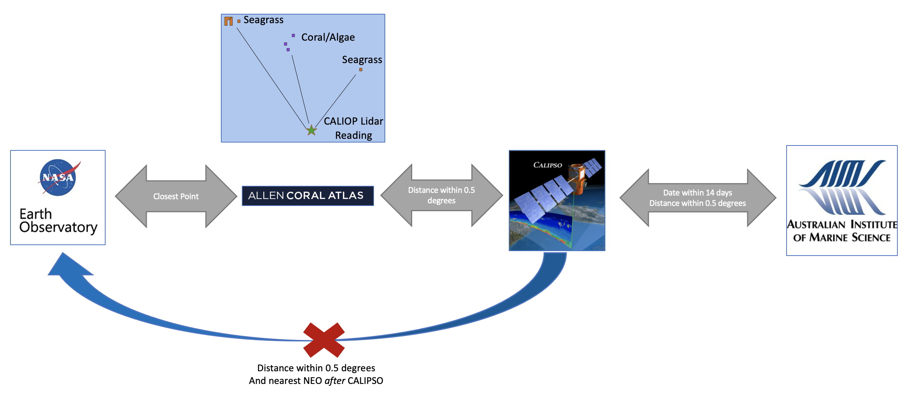
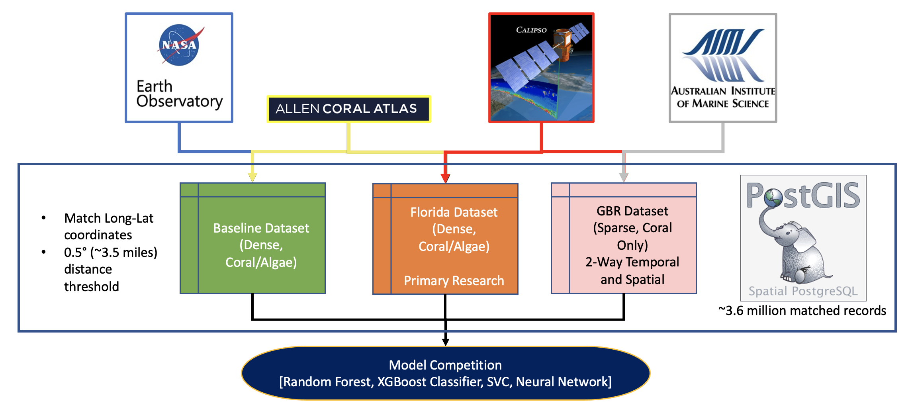

# Project GOTECH: Predicting Coral Presence Using Satellite-Based LiDAR

## Josh Mattingly, Tina Guo, and Dan Schauder

A Practicum Project for the Master of Science, Analytics Program at the Georgia Institute of Technology

        

GeorgiaTech_RGB.png
## Background

## Methods

###### Data Fusion
A nearest neighbor approach was used to pair response variables (coral/algae for Allen Coral Atlas and coral-only for AIMS survey) with either the CALIPSO or NEO predictor datasets.

A 0.5 degree threshold was established to limit matching of CALIPSO backscatter to the response sets.

## Results

## Future Work

## References

## Acknowledgements
